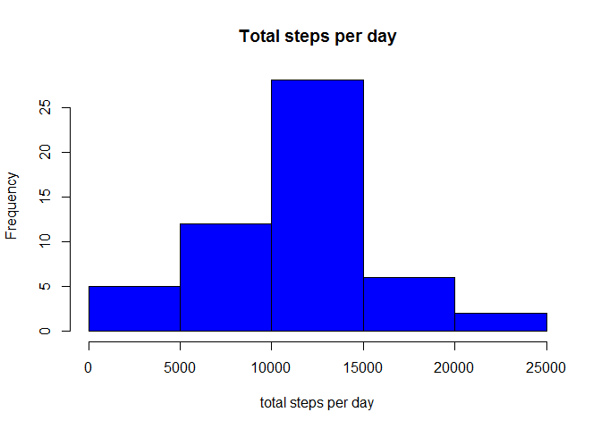
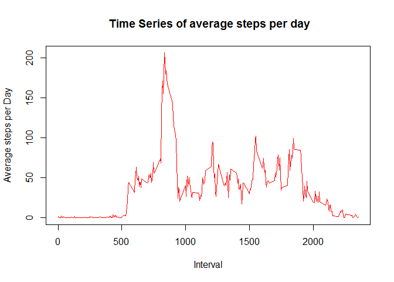
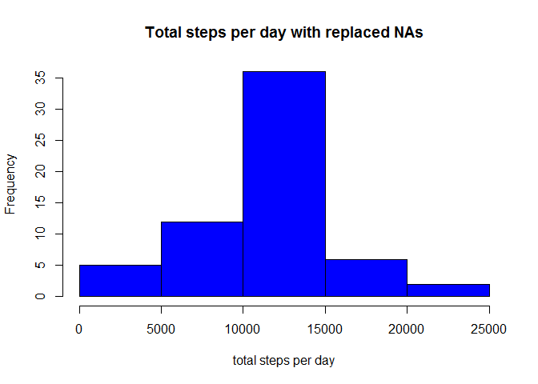
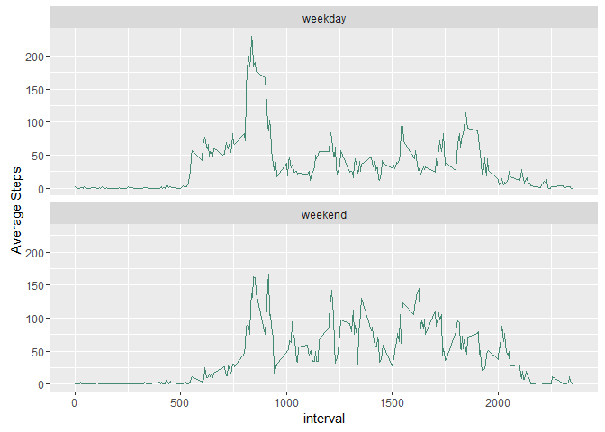

# Reproducible Research: Peer Assessment 1


## Loading and preprocessing the data
* Load the relevant libraries

```r
library(dplyr)
library(ggplot2)
```
* Load the data

```r
activity<- tbl_df(read.csv("./activity.csv",header=TRUE, na.strings = "NA"))
```
* Process/transform the data (if necessary) into a format suitable for your analysis

_Convert date column to date class_

```r
activity$date<-as.character(activity$date)
activity$date<-as.Date(activity$date,"%Y-%m-%d")
activity$date<- as.POSIXct(activity$date)
```
_Subset non-NA data_

```r
non_na_data <- activity %>%
  filter(!is.na(steps))
```
_Summarize total steps by date_

```r
steps_day <- non_na_data %>%
  group_by(date) %>%
  summarise(total_steps=sum(steps))
```


## What is mean total number of steps taken per day?

* Plot histogram of the number of steps taken per day

```r
hist(steps_day$total_steps, xlab="total steps per day", main="Total steps per day",col="blue")
```

\


* Calculate mean and media of total steps taken per day

```r
mean(steps_day$total_steps)
```

```
## [1] 10766.19
```

```r
median(steps_day$total_steps)
```

```
## [1] 10765
```

## What is the average daily activity pattern?
* Summarize mean number of steps by interval 

```r
time_series_steps <- non_na_data %>%
  group_by(interval) %>%
  summarise(avg_steps=mean(steps))
```
* Plot time series data

```r
plot(time_series_steps$interval,
     time_series_steps$avg_steps,
     xlab="Interval",
     ylab="Average steps per Day",
     main=" Time Series of average steps per day",
     col="red",
     type="l")
```

\


* Interval with the greatest number of steps

```r
time_series_steps[time_series_steps$avg_steps==max(time_series_steps$avg_steps),]$interval
```

```
## [1] 835
```


## Imputing missing values
* Number of N.A data

```r
sum(is.na(activity$steps))
```

```
## [1] 2304
```
* Fill in the N.A values
To fill the N.A values, I replaced the N.A values with the average steps per day in each time interval

```r
#fill NA data with mean of each time interval
list_of_na_intervals <- as.data.frame(activity$interval[is.na(activity$steps)])
names(list_of_na_intervals)[1]<-"interval"
list_of_na_intervals <- left_join(list_of_na_intervals,time_series_steps,by="interval")
activity$steps[is.na(activity$steps)]<- list_of_na_intervals$avg_steps
```
* Summarize the sum of steps by date

```r
steps_day_with_na <- activity %>%
  group_by(date) %>%
  summarise(total_steps=sum(steps))
```
* Plot histogram to visualize total steps per day after replacing the NAs

```r
hist(steps_day_with_na$total_steps,
     xlab="total steps per day",
     main="Total steps per day with replaced NAs",
     col="blue")
```

\


* Mean and median of total steps after replacing NAs

```r
mean(steps_day_with_na$total_steps)
```

```
## [1] 10766.19
```

```r
median(steps_day_with_na$total_steps)
```

```
## [1] 10766.19
```
* Do these values differ from the estimates from the first part of the assignment?
    * **Difference in mean** = 0
    * **Difference in median** = 1.1886792

* What is the impact of imputing missing data on the estimates of the total daily number of steps?

        The impact of imputing missing data on the estimates is small. The mean value is the same while the median value shows a very small difference of 1.1886792.

## Are there differences in activity patterns between weekdays and weekends?
* Add new variable 'day' that has two factors weekday or weekend

```r
activity$day=ifelse(weekdays(activity$date)%in%c("Saturday","Sunday"),"weekend","weekday")
activity$day=factor(activity$day,levels=c("weekday","weekend"))
```
* Summarize mean steps per day by interval/type of day

```r
time_series_week <- activity %>%
  group_by(interval,day) %>%
  summarise(avg_steps=mean(steps))
```
* Create a panel plot containing a time series plot of 5-min interval and the avg number of steps taken averaged across all weekday days or weekend days 

```r
ggplot(time_series_week,
       aes(interval,avg_steps))+
       geom_line(color="aquamarine4",lwd=0.5)+
       facet_wrap(~day, nrow=2)+
       ylab("Average Steps")
```

\
